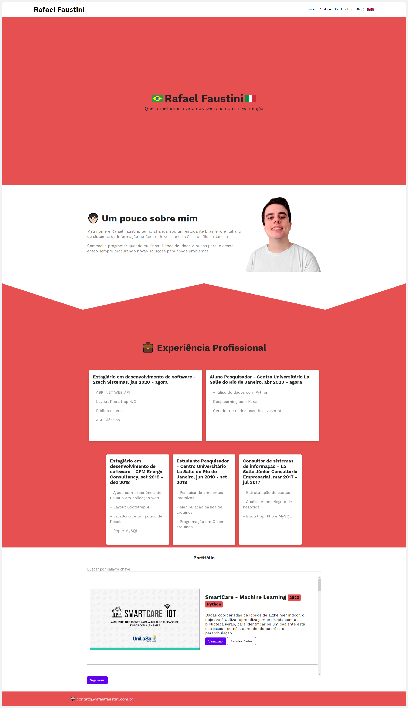

# [https://rafaelfaustini.com.br]

## Styling

For the styling, SASS was used and no external libraries were used such as bootstrap. The SASS code was also built in an architecture called [7-1](https://github.com/HugoGiraudel/sass-boilerplate).

## Javascript

In order to take some advantage of reactivity and code reuse, I used the Vue library so that I could make components such as the projects visualization in my portifolio section

